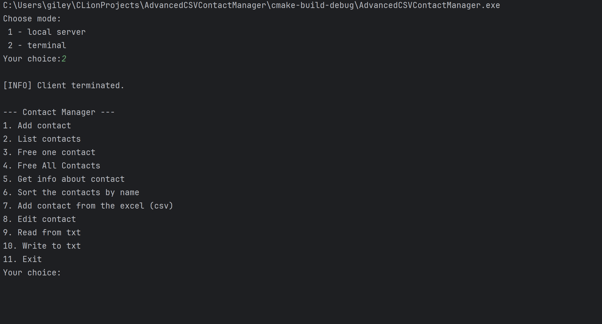
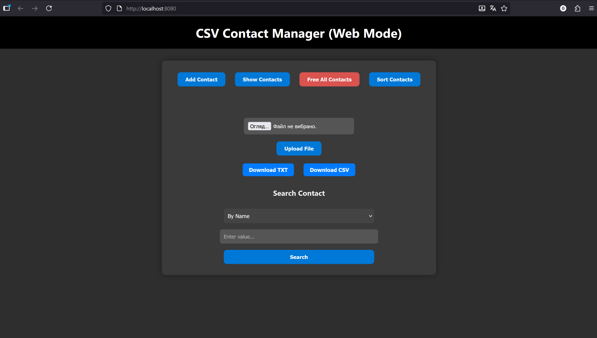

Introduction

This project implements a memory-efficient CSV and TXT manager written in C, demonstrating practical use of dynamic memory management, file I/O, string manipulation, structured data handling, and intermediate sorting algorithms.

It also integrates a lightweight web interface using the CivetWeb library to connect a C backend with an HTML, CSS, and JavaScript frontend.

The program consists of the following main components:

main.c – the entry point of the application. It calls either StartServer() or StartContactManager() (CLI version) based on the choice of the user.

StartServer() – handles HTTP requests through CivetWeb, enabling interaction between the backend logic and the web interface.

StartContactManager() - provides a command-line interface (CLI) version of the program for terminal use.

Features

CLI version

* Add contact to memory
* List contacts that are stored in the memory 
* Free one contact (on the users choice)
* Free All contacts
* Get info about contact (by name) 
* Sort contacts by name (first letter right now) usig Merge Sorting algorithm
* Add contacts from CSV file 
* Edit contact (any value)
* Add contact from txt
* Write contact to txt
* Exit from the loop

WebVersion 

* Add contact (fill the form) 
* Show contacts 
* Free all contacts
* Sort contacts
* Upload a CSV or TXT file (and add contacts from that files)
* Download contacts list in TXT or CSV type
* Search by any value user wants 
* Free one contact (in list or when we found)
* Edit contact 

Installation \& Setup

**Install CivetWeb**

Download and install the CivetWeb library from its official GitHub repository.

It provides the embedded HTTP server used to connect the C backend with the web frontend.

**Set up the web interface**

Create a folder named www/ in the project directory.

Inside it, store all your frontend files — index.html, style.css, and script.js.

The backend loads these files using standard C file I/O functions such as fopen() to serve them to the browser.

Build environment

The project is developed in CLion using standard C11 libraries and CMake for configuration.

No additional dependencies are required beyond CivetWeb.

Technologies Used 

C (C11), CivetWeb, HTML, CSS, JavaScript, CLion, CMake 

**Future Improvements \& Debugging**

**Fix the sorting functions**

Occasionally, the sorting algorithms trigger heap corruption or invalid memory access.

This needs a full review of pointer usage, memory allocation, and boundary checks.

**Detect and handle duplicates**

Implement proper duplicate checking for names, emails, and phone numbers during contact creation.

The system should either prevent duplicates or notify the user before adding them.

**Public deployment**

Set up a custom domain and host the web interface so the manager can be accessed remotely — turning the project into a practical online contact management tool.

Short descriptions of the most important functions

CLI Functions

Add Contact

Creates an input buffer and reads user data via fgets().

The program then allocates memory dynamically, sized exactly for the entered string, and copies the value using a custom StrCopy() function.

This ensures efficient memory use without unnecessary allocation.

Free All Contacts

Iterates through the contact list, frees all dynamically allocated fields, and resets their pointers to NULL.

This prevents memory leaks and clears the entire contact array from dynamic memory.

Free One Contact

Uses the SearchContact() function to locate a specific record and frees only that contact’s allocated memory.

It’s essentially a targeted cleanup version of Free All Contacts.

Validation Functions

Ensure that all inputs are valid strings and properly formatted.

The IsValidPhoneNumber() function additionally verifies whether a phone number’s prefix matches the corresponding country code, using data read via fscanf() from a country list file.

Web Functions

RunServer (CivetWeb Integration)

Launches the embedded CivetWeb HTTP server, which connects the backend logic with the web interface.

Handles client requests such as /add, /list, /delete, and /free, sending formatted HTML responses.

HandleAddContact()

Processes form data submitted from the web UI.

Reads fields from an HTTP POST request, validates input, and creates a new contact record dynamically — same logic as the CLI version but triggered by a browser form.

HandleFreeAllContacts()

Frees all dynamically stored contacts and returns an HTML confirmation page with a success message.

HandleListContacts()

Generates an HTML table containing all contacts currently stored in memory and sends it to the browser.

HandleUploadFile()

Manages file uploads from the frontend (CSV or TXT files).

Saves them temporarily on the server, parses their contents, and adds valid contacts to memory.

